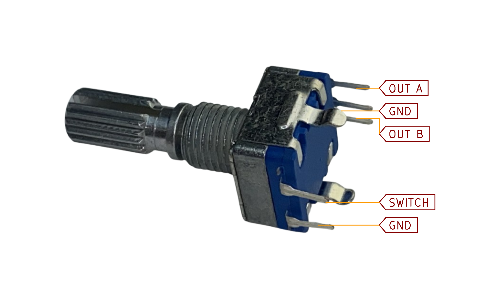

# Raw Rotary Encoders
:stopwatch: Reading time: 10 minutes.

## *Raw* and *Advanced* Rotary Encoders
A *raw* **Rotary Encoder** is just the physical device itself. You can directly connect it to your microcontroller and work with it. This is what I am going to demonstrate here.

Working with **Rotary Encoders** directly can be painful, though, because they send raw data that needs to be post-processed and interpreted in order to figure out what the **Rotary Encoder** is actually doing. The burden is on the firmware (your software). Luckily, there are ready-to-use libraries that take over most of the tricky part.

What they cannot work around is the fact that *raw* **Rotary Encoders** require **4** GPIO pins. If the encoder acts as a switch when you press it, you need a total of **5** GPIO switches.

That's why there are also *advanced* **Rotary Encoders** (discussed elsewhere): the encoder is mounted on a separate breakout board with its own mini-processor who does all the heavy lifting: signal interpretation, noise, post-processing, communication. 

Such boards typically communicate via *IC2*: just two GPIO pins are needed (not five), and they are shared among all other *I2C* devices. If you increase the number of **Rotary Encoders** in your project, the number of required GPIO stays the same.

In this section, I am looking at working with **Rotary Encoders** directly.

## Testing A *Raw* Rotary Encoder

Here is a test setup to examine how a directly connected **Rotary Encoder** can be used.

For this test, you need this:

* **Microprocessor**: I am using an *ESP8266*.
* **Rotary Encoder**: I am using a vanilla encoder with built-in switch (5-pn model)
* **OLED Display**: I am using a vanilla *I2C* 0.96 inch *SSD1306* display

> [!NOTE]  
> If you have never worked with *OLED* displays before, then you should now. Of course you could output information to the *IDE*s serial monitor and skip the *OLED* stuff. But after all, we are all creating gadgets and fun electronics for the real world, so serial monitor output is really no fun.
>
> *OLED* displays are so inexpensive, so readily available, and so easy to use that you shouldn't hesitate to routinely add them to your microcontroller projects for outputting information in a fun and intuitive way.

### Different Types

When you purchase a *really raw* **Rotary Encoder**, you get an encoder switch which looks similar to a potentiometer and has four or five "legs", two on one side and two or three on the other:

Most of the time, **Rotary Encoders** are used mounted on a very simple breakout board which typically adds three pullup resistors and provides easily accessible output pins:

Here is the schematic of such a breakout board:

### Schematics

