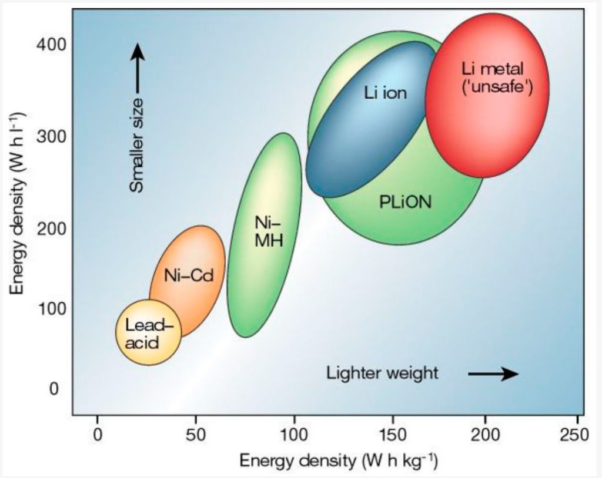

# Battery Management System (BMS)
:stopwatch: Reading time: 10 minutes.

## Overview

Modern *lithium ion*, *lithium polymer*, and *LiFePo4* rechargable batteries store huge amounts of energy. 

Even small batteries can wreck havoc when the battery is short ciruited and catch fire, and while these batteries are a solid source of portable power, they can be damaged and destroyed by wrong *charging* and *discharging*.

*Battery Management Systems* (BMS) are electronic circuits that you can add to provide the necessary protection. Most high-quality batteries come with a *BMS* built-in. They are then labelled *protected*.

When you use such batteries to power your projects and devices, in many cases you should add your own *BMS*. For example, if you build your own *power banks*, *power packs*, or generally connect more than one battery *in series*, you need your own *BMS* to *balance* the individual batteries during charging.

> [!CAUTION]
> Below, I am discussing handling the commonly used *lithium ion* and *lithium polymer* batteries. The thresholds mentioned below may vary slightly for different manufacturers and are a general rule of thumb. Always consult the data sheet of the battery you actually use.
>
> If you use batteries with different chemistry, for example a *LiFePo4* battery, and even more *lead* or *NiCad*, very different thresholds and concepts may apply.
>
> The following battery chemistries are in wide use:

### Battery Voltage Ranges

| Chemistry | Min V | Max V | Nominal | 
| --- | --- | --- | --- | 
| LiIon | 2.7V | 4.2V | 3.7V | 
| LiPo | 3V | 4.2V | 3.7V | 
| LiFePo4 | 2.5V | 3.65V | 3.2 | 

* **Minimum Voltage**: If you continue to *discharge* the battery below *minimum voltage*, it can get permanently damaged. If you *charge* a battery that has a below-minimum voltage, much of the energy may be converted to heat, potentially leading to fire and explosion.
* **Maximum Voltage**: When *charging* a battery, the voltage increases up to the *maximum voltage* when it is fully loaded. When you continue to charge a battery beyond its *maximum voltage*, the energy can no longer be stored and is converted to heat, potentially leading to fire and explosion.
* **Nominal Voltage**: When in operation, the battery *on average* delivers the *nominal voltage*. Lithium batteries generally have a very flat voltage discharge curve, so between *minimum* and *maximum* voltage, the battery will deliver the *nominal voltage* for a very long period of time.

  
Energy Density
 

 ### Voltage Differences
  

### Energy Density and Use Cases

* *LiIon* and *LiPo* batteries have a very high energy density. They are used when space restraints exist and when weight is a consideration (i.e. in drones).
* *LiPo* batteries come as pouches in various sizes and shapes. They are often used inside of devices where space constraints exist.
* *LiFePo4* batteries have a slightly lower energy density. To store the same amount of energy, they are a bit bulkier and heavier. Other than *LiPo* and *LiIon*, *LiFePo4* batteries do not typically explode when damaged and are considered much safer. They also can provide a much higher discharge current.  Both is important when dealing with large energy capacities. *LiFePo4* is more robust, too: with a lifespan of 10 years and 3000 recharge cycles, they last much longer than other battery chemistries. *LiFePo4* is used in *high capacity* batteries and when space and weight is no constraint, i.e. boats, RC, photo voltaic storage, emergency power supply.  

Energy density is the amount of energy stored, measured either by weight (*Wh/kg* - Watt hours per kilogram) or by volume (*Wh/l* - Watt hours per liter).

The chart below (taken from [MDPI](https://www.mdpi.com/1996-1073/12/6/1074/htm)) illustrates the fundamental differences in energy density between different battery chemistries. The key takeaway is that all *lithium*-based batteries have a much higher energy density compared to older technology such as *NiMH*, *NiCad*, let alone *lead acid* car batteries.

### Important Protection Features

The following protection features are important and should be provided by the *BMS* you choose:

| Feature | Typical Threshold | Description |
| --- | --- | --- |
| Over voltage | >4.3V | Protects the battery from *over-charging*. When empty batteries are charged, their voltage slowly rises. When the battery is fully charged, it typically has a 4.2V voltage

Whenever you connect more than one battery in *series*
[Small loads (up to 3A)](small)
[Medium loads (up to 8A)](medium)
