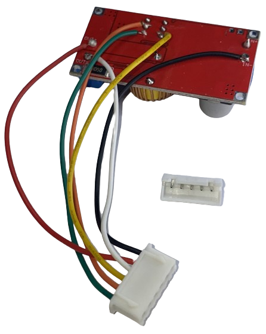

# Step 1: Interfacing With Buck Converter
:stopwatch: Reading time: 5 minutes.

## Soldering Wires To Buck Converter

The **Buck** controller is not changed in any way. The digital control we want to add is a completely separate *external component*. We just need a way to interface them.

These are the connection points we need access to:

  
:information_source: Why we need access to these six pins

  
According to the schematics, we need a total of *six* wires to connect to the **Buck** controller:

|  Pin |  Description | Color Wire |
| --- | --- | --- |
| GND IN | Measure current | 	:white_square_button: Black |
| GND OUT | Measure current | :black_square_button: White |
| V+ OUT | Measure voltage | :red_square: Red |
| POT1 | Voltage control | :yellow_square: Yellow |
| POT2.1 | Current control | :orange_square: Orange |
| POT2.2 | 0V reference | :green_square: Green |

* **Measuring Current**: The **Buck** controller connects **GND IN** with **GND OUT** across a *R050* shunt resistor used internally to meassure the current. Since we also need to know the current, we too measure the voltage drop. For this, all we need is access to the terminals **GND IN** and **GND OUT**.
* **Measuring Voltage**: To measure the output voltage, we also need access to the terminal **V+ OUT**. Voltage can then directly measured either against **GND IN** or **GND OUT** (the voltage drop at the shunt resistor is neglectible and can also be adjusted by software later)
* **Controlling Constant Voltage**: To digitally control constant voltage, we need a connection to the voltage sensor pin of the **XL4015** which can conveniently be accessed at one of the *CV* *portentiometer* pins.
* **Controlling Constant Current**: Same goes for current settings: our injected voltage goes into the *middle* leg of the **CC** *potentiometer* pin.
* **0V Reference**: We also need a **0V** reference (more later) which is accessible at the **CC** *potentiometer*.

### Next Step

Now that the interface to the **Buck** controller is in place, we need a way for the microcontroller to attach to it and perform its first task: monitoring *voltage* and *current*. [The next part explains this](2_monitoring_voltage_and_current.md).
