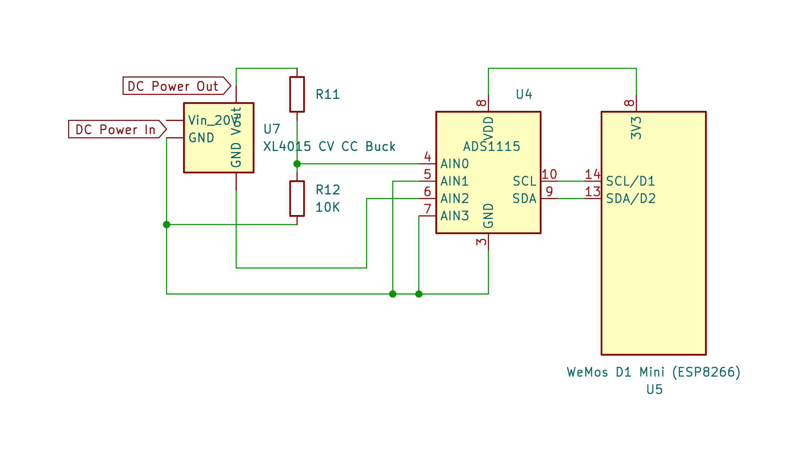

# Controlling Buck Converter Via Voltage Injection
:stopwatch: Reading time: 20 minutes.

## Quick Overview

Recently, I came across an [Instructables](https://www.instructables.com/DIgital-Controlled-Bench-Power-Supply/) article from *Robert Tidey* where he built a digitally controlled bench power supply based on readily available and cheap *XL4015*-based **5A CV CC** *Buck* breakout boards.

> [!TIP]
> Boards like the one above run at less than €1.50 and provide realistic *3-4A* of current. By default, you manually set the output *voltage* and *current* using trim potentiometers.
>
> When you get these, make sure you order the ones with **two potentiometers** (very similar ones come with just **one potentiometer** and support *constant voltage* only).
>
> You might want to visit places like *AliExpress* as price differences are huge: you get them for as much as €15 and as low as €1 (I just got 4 for € 3.38, €0.85 per unit, including customs and delivery).

I immediately catched fire as this sounded like a clever technique, possibly adoptable to other (and possibly more powerful) *buck* converters, and useful to so many projects:

* **Bench Power Supply**: create your own modern bench power supply with cool custom-designed LCD, TFT or OLED displays, wireless controllable, with monitoring and data logging - thanks to digital control, ESP8266 et al can enhance functionality enourmously.
* **Automated Testing**: a script or computer program can quickly change voltage and current based on test protocols, i.e. for automated device testing.
* **Clever Chargers**: ever wanted to charge your *LiPo*s or *LiFePo4*s with love, using *exactly* the recipe you trust most? With readily available and cheap components, you could build your own highly customizable battery charger that first charges gently with **CC**, then adds more current, and finally tops it off with a *constant voltage* charging phase, all of this of course with a charging protocol that shows battery health and can be used for documentation.
* **Sophisticated LED drivers**: tired of flickering **PWM** dimmed LEDs? Now you could directly control the *current* and create simple but effective *LED drivers* with wireless and bluetooth control for beautiful LED displays.

I am sure there are plenty additional community ideas what else you could do with digitally controllable power supplies.

So I visited Roberts [github](https://github.com/roberttidey/WifiPowerSupply) repository, and contacted him.

Below you can follow me with my steps to rebuild the digitally controllable power supply, and if you, too, catch fire, easily follow along and you build your own.

### Approaches To Digital Controllability

Off-the-shelf **Buck** converters typically come with two potentiometers to adjust *voltage* and *current*. To digitally control this, there are a few approaches:

* **Digital potentiometers**: Replace the manual resistors with digital potentiometers like the *MCP41**HV**51* (make sure it is this specific **HV** type as most digital potentiometers support only logic-level voltages and will be destroyed when used with the voltages present in **Buck** converters.
* **Injecting Voltage**: Potentiometers in **Buck** converters often work as simple *voltage dividers* to produce a given voltage that then is used to set output voltage and limit output current. When you turn the potentiometer to a defined value and leave it there, you can also produce a voltage, i.e. by a **DAC** (*digital-to-analog converter*), then *inject* this voltage to one of the potentiometer pins.

The latter is *Richards* approach, and there are at least two advantages over the digital potentiometer idea:

* **More granularity**: affordable high voltage digital resistors are 8bit (256 steps) whereas *DAC*s typically have 12-16 bits (more precise control)
* **Less Tweaking**: to use digital potentiometers, you first need to remove the physical potentiometers. While desoldering them is no rocket science, it is a significant change in the **Buck** device. To *inject* voltage, in contrast, you do not touch the **Buck** breakout board at all. There are just three easily-identifyable solder pins where you need to attach wires.

## Basic Setup

The schematics below explain the general idea:

At the heart of this design is a microcontroller (*ESP8266*) that reads the *voltage* and *current* and then generates the appropriate voltages that need to be injected into the **Buck** breakout board. 

Let's break this into separate steps for better understanding, and to help building this project in separately debuggable parts. 

## Step 1: Reading Voltage And Current

The microcontroller needs to know the actual *voltage* and *current* before it can tell the **Buck** breakout board what to do. 

Let*s look at this part first. Viewed isolated, it is much easier to understand, and you can re-use this logic for many other purposes, i.e. to monitor batteries or build your own *Coloumbmeters*.

### ADS1115 - Reads Voltages

The *voltage* and *current* measuring is done by a **ADS1115**: a cheap and precise 12-bit *ADC* (Analog-To-Digital-Converter). 

It comes with four inputs marked as *AIN0* to *AIN3*. The chip communicates via **I2C** so it is connected to the microcontroller with just two wires: *SCL* and *SDA*.

> [!NOTE]  
> Most microcontrollers like *Arduino* and *ESP8266* come with their own *ADC* built-in. You could skip the *ADS1115* and use the built-in *ADC* instead to save a bit.
>
> However, the built-in *ADC*s are much less precise and much more susceptible to external influences. In an application that is designed to control output *voltage* and *current* of a power supply you need precise and robust readings. After all, you cannot have an unexpected voltage surge just because there is noise on the line.
>
> It's well invested money to use external *ADC*s in your projects. After all, a *ADS1115* cost less than €2 and is well worth it.

### Measuring Voltage

The *voltage* is measured by *AIN0* and *AIN1*: *AIN0* is connected to the positive *output* voltage, and *AIN1* is connected to **GND**. The measured *difference* is the *output voltage*.

> [!IMPORTANT]  
> Most *ADC*s can measure only a limited voltage range and are very sensitive to over-voltage. That's why the *ADS11215* cannot measure the output voltage directly. It is too high.
>
> Instead, a *voltage divider* is used (*R11* and *R12*). The resistor values *1K* and *10K* drop the measured voltage by factor 10 so it is now in the safe range for the *ADS1115* input.

> Even though the *ADS1115* comes with *four* independent inputs and can measure *four* different input voltages against **GND**, it alternatively supports a *differential mode* where it can measure *voltage differences* between two inputs, respectively. This *can* be more precise, and it *can* be used to also measure negative voltages.
>
> However, nothing is won if the second input is connected to **GND** (which is what the one-pin input does by default).
>
> I may be overlooking the obvious, and will investigate further, but on first sight it appears as if *AIN1* could safely be used for other purposes: *AIN0' would yield the same result when used in default *single pin* mode.

### Meassuring Current

*Current* cannot be measured directly. An *ADC* can measure *voltage* only. One way of measuring *current* is by measuring the *voltage drop* at a low-resistance *shunt* resistor.

The **Buck** converter used here has a shunt resistor mounted on its back and uses it internally to measure the output current. The shunt resistor is connected in series between **GND** input and **GND** output: the other two *ADC* inputs (*AIN2* and *AIN3*) are therefore connected to the **output GND** and the **input GND**.

Since the voltage drop typically is a very low voltage, no additional *voltage divider* is required here. 

> [!TIP]
> To create the digitally controllable **Buck** converter, all we need is a way for the microprocessor to know the *voltage* and *current*.
>
> Using an **ADS1115** and taking advantage of the *shunt resistor* built into the **Buck** converter (as illustrated here) is one clever way of doing so. There are many alternatives, though. You could use a *hall sensor* to measure *current* (i.e. if you wanted to adapt this concept to different **Buck** converters that have no easily accessible *shunt resistor*), or use your own *shunt resistor*.
>
> In fact, there are cheap boards available based on *INA226* or *INA3221* that do *current* and *voltage* measuring via *I2C* as a one-stop solution. They are also super cheap. However, most of them use *R100* shunt resistors and can only handle a maximum of **3A**. 

### Building And Testing

The actual *building* and testing, including *programming* the microprocessor and adjusting the raw input readings from *ADS1115* to display the measured *voltage* and *current* on a *OLED* display can be found here (TBD, coming soon).

## Step 2: Regulating the **Buck** Controller

Once the microcontroller knows the exact *voltage* and *current*, it can start controlling the **Buck** converter, asking to increase or decrease *voltage* and/or *current*. How this is done is the clever trick and special beauty of this solution:

* **Potentiometers**: By design and stand-alone, the **Buck** converter controls *constant voltage* and *constant current* via two manually operated potentiometers. Both potentiometers are marked **W103** so they are **10K**.
* **Constant Voltage**: To keep the voltage constant, the voltage regulator *XL4016* inside the **Buck** converter uses a *voltage divider*, consisting of a 270R fixed resistor *R3* and the potentiometer *RV1*.

The potentiometer *RV1* controls the feedback voltage that the *XL4015* receives. To digitally control the *constant voltage*, a *DAC* (digital-to-analog converter) is later feeding in external control voltage to mimick a physical change in potentiometer setting.

* **Constant Current**: To keep the *current* constant, a second potentiometer is used similarly, and again, a *DAC* is used to feed in the external voltage necessary to raise the control voltage as if the potentiometer setting was changed.
